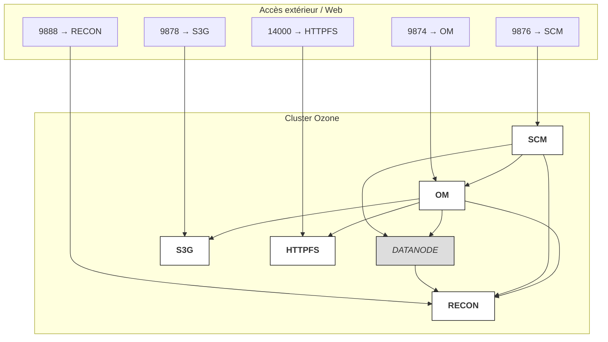

# apache-ozone

```mermaid

flowchart TD

    subgraph WEB[Accès extérieur / Web]
        W1[9874 → OM]
        W2[9876 → SCM]
        W3[9888 → RECON]
        W4[9878 → S3G]
        W5[14000 → HTTPFS]
    end

    subgraph CLUSTER[Cluster Ozone]
        RECON
        SCM
        OM
        DATANODE
        S3G
        HTTPFS
    end

    %% Relations internes
    SCM --> OM
    OM --> DATANODE
    SCM --> DATANODE
    OM --> RECON
    SCM --> RECON
    DATANODE --> RECON
    OM --> S3G
    OM --> HTTPFS

    %% Accessibilité depuis le web
    W1 ---> OM
    W2 ---> SCM
    W3 ---> RECON
    W4 ---> S3G
    W5 ---> HTTPFS

    %% Services non exposés
    class DATANODE internal

    %% Styles
    classDef exposed fill:#ffffff,stroke:#000,font-weight:bold
    classDef internal fill:#dddddd,stroke:#000,font-style:italic

    class SCM,OM,RECON,S3G,HTTPFS exposed
``` 
